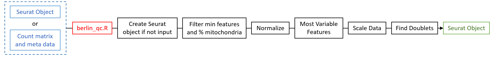
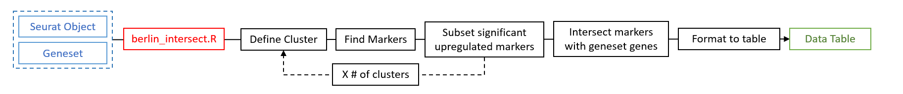
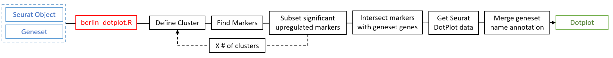
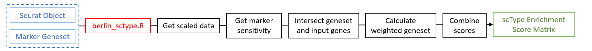
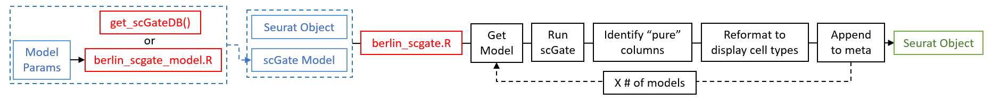
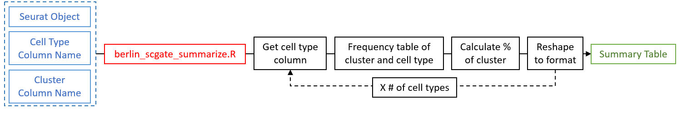

```{css, echo=FALSE}
    body .main-container {
      max-width: 1280px !important;
      width: 1280px !important;
    }
    body {
      max-width: 1280px !important;
    }
```

```{r, include = FALSE}
knitr::opts_chunk$set(
  collapse = TRUE,
  comment = "#>"
)
```

# Basic Exploration of single-cell RNAseq data and LINeages

# Introduction

The utilization of single-cell RNA sequencing (scRNA-seq) has emerged as a robust approach to examining the complexities of cellular heterogeneity and genetic expression with distinctive resolution. However, analyzing scRNAseq data can be complex and requires a standardized approach. This protocol outlines a comprehensive workflow for analyzing scRNAseq data using R and the Seurat package, along with other tools like SeuratDisk, patchwork, dplyr, Single R, and Celldex. The protocol covers essential steps such as quality control, normalization, data scaling, dimension reduction, clustering, and automated cell annotation. Following this protocol allows bioinformaticians and researchers to effectively analyze scRNAseq data, identify distinct cell populations, and gain valuable insights into cellular dynamics and functions. The output files generated by this protocol, including metadata, H5 Seurat files, cell sub population metadata, and ISCVA-compliant files, facilitate downstream analyses and enable integration with other analysis and visualization tools. This protocol provides a standardized and reproducible framework for scRNAseq analysis.

# Installation

BERLIN is available to install from GitHub via `devtools`. Currently, it does require the pre-installation of the `celldex` package from Bioconductor. This is a package used to obtain databases for single cell annotation.

```{r message=FALSE, warning=FALSE}
#install.packages("devtools")
#install.packages("BiocManager")
#install.packages("remotes")

#BiocManager::install("celldex")
#remotes::install_github("mojaveazure/seurat-disk")
#devtools::install_github("shawlab-moffitt/BERLIN")

library("SeuratDisk")
library("DT")
library("scGate")
library("BERLIN")
```

# Data Input

The starting data for the BERLIN workflow can be input in two different methods, a Seurat object or a count matrix with an optional meta data table.

```{r message=FALSE, warning=FALSE}
h5seruat_file <- "GSE162631_corrected_merged_both_macrophages_peri_h5.h5seurat"
seruat_obj <- SeuratDisk::LoadH5Seurat(h5seruat_file, assays = "RNA")
print(seruat_obj)
```

# Getting Started

<center>

{width="100%"}

</center>

```{r message=FALSE, warning=FALSE}
obj_qc <- berlin_get_started(object = seruat_obj)
print(obj_qc)
```

# SingleR Annotation

<center>

{width="100%"}

</center>

```{r message=FALSE, warning=FALSE}
obj_qc_anno <- berlin_SingleR(object = obj_qc,
                               verbose = FALSE)
```

# Dimension Reduction and Clustering

<center>

{width="100%"}

</center>

```{r message=FALSE, warning=FALSE}
obj_qc_anno_cl <- berlin_unsupervised_analysis(object = obj_qc_anno)
print(obj_qc_anno_cl)
```

# Finding Cluster Markers

## Differential gene expression across clusters

<center>

{width="100%"}

</center>

```{r message=FALSE, warning=FALSE}
cluster_markers <- berlin_marker_analysis(object = obj_qc_anno_cl)
class(cluster_markers)

# Geneset of significant up and downregulated FindMarkers results
class(cluster_markers$FindMarkers_Geneset)
head(cluster_markers$FindMarkers_Geneset)

cluster_markers_df <- cluster_markers$FindMarkers_Results
DT::datatable(cluster_markers_df,
              options = list(lengthMenu = c(5,10, 20, 100, 1000),
                             pageLength = 5,
                             scrollX = T))


```

## Intersect Genesets with Cluster Markers

<center>

{width="100%"}

</center>

```{r message=FALSE, warning=FALSE}
Tumor_MyelMarks_HS <- read.delim("PMID35690521_HumanTumorMyeloidMarkers_20241226.tsv", sep = '\t', header = T)
head(Tumor_MyelMarks_HS)

obj_intersect_TumMyelMarks_df <- berlin_intersect(object = obj_qc_anno_cl,
                                                  geneset = Tumor_MyelMarks_HS)

DT::datatable(obj_intersect_TumMyelMarks_df,
              options = list(lengthMenu = c(5,10, 20, 100, 1000),
                             pageLength = 5,
                             scrollX = T))
```

## Dotplot Heatmap of Grouped Geneset Gene Expression Across Clusters

<center>

{width="100%"}

</center>

```{r message=FALSE, warning=FALSE, fig.height = 7, fig.width = 14}
# Subset geneset to annotations of interest
genesets_of_interest <- unique(Tumor_MyelMarks_HS$Annotation)[c(1:4)]
Tumor_MyelMarks_HS_sub <- Tumor_MyelMarks_HS[which(Tumor_MyelMarks_HS$Annotation %in% genesets_of_interest),]

# Generate dotplot heatmap
dotplot <- berlin_dotplot(object = obj_qc_anno_cl,
                          geneset = Tumor_MyelMarks_HS_sub)
dotplot
```

## Annotating clusters with genesets using Jaccard

```{r message=FALSE, warning=FALSE}
# Subset geneset to annotations of interest
marker_jaccard <- berlin_jaccard(object = obj_qc_anno_cl, geneset = Tumor_MyelMarks_HS)

DT::datatable(marker_jaccard,
              options = list(lengthMenu = c(5,10, 20, 100, 1000),
                             pageLength = 5,
                             scrollX = T),
              rownames = F)
```

# scType

<center>

{width="100%"}

</center>

## BERLIN Geneset Database

```{r message=FALSE, warning=FALSE}
# Available Geneset Options
ScType_genesets()

scType_gs1 <- "immune"
data(list = paste0("ScType_immune_system_PosIndicator_Geneset_DB"), package = "BERLIN")
head(ScType_immune_system_PosIndicator_Geneset_DB,3)
data(list = paste0("ScType_immune_system_PosIndicator_Geneset_DB"), package = "BERLIN")
head(ScType_immune_system_PosIndicator_Geneset_DB,3)

scType_gs2 <- "brain"
data(list = paste0("ScType_",tolower(scType_gs2),"_PosIndicator_Geneset_DB"), package = "BERLIN")
head(ScType_brain_PosIndicator_Geneset_DB,3)

```

## Running BERLIN Provided Geneset

```{r message=FALSE, warning=FALSE}
sctype_brain_res <- berlin_sctype(object = obj_qc_anno_cl,
                                  geneset = "brain")

DT::datatable(head(sctype_brain_res,c(20,20)),
              options = list(lengthMenu = c(5,10, 20, 100, 1000),
                             pageLength = 5,
                             scrollX = T))
```

## Running Positive and Negative Indicator Genesets

```{r message=FALSE, warning=FALSE}
sctype_immune_res <- berlin_sctype(object = obj_qc_anno_cl,
                                   pos_geneset = ScType_immune_system_PosIndicator_Geneset_DB,
                                   neg_geneset = ScType_immune_system_PosIndicator_Geneset_DB)

# scType enrichment score matrix
DT::datatable(head(sctype_immune_res,c(20,20)),
              options = list(lengthMenu = c(5,10, 20, 100, 1000),
                             pageLength = 5,
                             scrollX = T))
```

## Identify scType Cell Type Classifications

additional columns appended to Seurat object meta data that classify the cell type identified by the scType results matrix.

```{r message=FALSE, warning=FALSE}
obj_qc_anno_cl_sct <- berlin_sctype_classify(object = obj_qc_anno_cl,
                                             score = sctype_immune_res,
                                             cluster_col = "seurat_clusters")
sctype_new_meta <- obj_qc_anno_cl_sct[[]]
# scType enrichment score matrix
DT::datatable(sctype_new_meta,
              options = list(lengthMenu = c(5,10, 20, 100, 1000),
                             pageLength = 5,
                             scrollX = T))
```

## Summarize scType Cell Level Classifications

```{r message=FALSE, warning=FALSE}
scType_Cell_Summary <- berlin_sctype_summarize(object = obj_qc_anno_cl_sct)

# scType celll level summary
DT::datatable(scType_Cell_Summary,
              options = list(lengthMenu = c(5,10, 20, 100, 1000),
                             pageLength = 5,
                             scrollX = T))
```


# scGate

<center>

{width="100%"}

</center>

## Generate Custom scGate Model

### Example Model Parameters Input

```{r message=FALSE, warning=FALSE}
model_param <- read.delim("scGate_Params_myeloid_macrophage_model.txt", sep = '\t', header = T)

DT::datatable(model_param,
              options = list(lengthMenu = c(5,10, 20, 100, 1000),
                             pageLength = 5,
                             scrollX = T))
```

### Model Generation

```{r message=FALSE, warning=FALSE}
scGate_myl_mac_model <- berlin_scgate_model(params = model_param)

# Model composed of multiple celltypes
class(scGate_myl_mac_model)

# Example celltype data
DT::datatable(scGate_myl_mac_model$Macrophage,
              options = list(lengthMenu = c(5,10, 20, 100, 1000),
                             pageLength = 5,
                             scrollX = T))
```

### Run Single scGate Model

```{r message=FALSE, warning=FALSE}
obj_qc_anno_cl_sct_scg_1mod <- berlin_scgate(object = obj_qc_anno_cl_sct,
                                              model = scGate_myl_mac_model,
                                              model_name = "Myeloid_Macrohphage")

# scGate Results appended to metadata
scg_1mod_meta <- obj_qc_anno_cl_sct_scg_1mod[[]]
DT::datatable(scg_1mod_meta,
                  options = list(lengthMenu = c(5,10, 20, 100, 1000),
                                 pageLength = 5,
                                 scrollX = T))
```

## Use scGate Model Database

### Obtain multiple models from scGate

```{r message=FALSE, warning=FALSE}
scGate_models_DB <- get_scGateDB()
class(scGate_models_DB)
names(scGate_models_DB)

scGate_models_DB_human <- scGate_models_DB[["human"]]
class(scGate_models_DB_human)
names(scGate_models_DB_human)

scGate_models_DB_human_sub <- scGate_models_DB_human[c("CD8_TIL","PBMC")]
class(scGate_models_DB_human_sub[["CD8_TIL"]])
names(scGate_models_DB_human_sub[["CD8_TIL"]])
head(scGate_models_DB_human_sub[["CD8_TIL"]][[1]])
```

### Run Multi-Model scGate Analysis

```{r message=FALSE, warning=FALSE}
obj_qc_anno_cl_sct_scg_multimod <- berlin_scgate(object = obj_qc_anno_cl_sct,
                                                 model = scGate_models_DB_human_sub)

# scGate Results appended to metadata
scg_multimod_meta <- obj_qc_anno_cl_sct_scg_multimod[[]]
DT::datatable(scg_multimod_meta,
              options = list(lengthMenu = c(5,10, 20, 100, 1000),
                             pageLength = 5,
                             scrollX = T))
```

## Summarize scGate Results

<center>

{width="100%"}

</center>

### Summarize Single Model Results

```{r message=FALSE, warning=FALSE}
scg_1mod_summ <- berlin_scgate_summarize(object = obj_qc_anno_cl_sct_scg_1mod,
                                         celltype_col = "scGate_Myeloid_Macrohphage_Celltype",
                                         cluster_col = "seurat_clusters")
# scGate Summary
DT::datatable(scg_1mod_summ,
              options = list(lengthMenu = c(5,10, 20, 100, 1000),
                             pageLength = 5,
                             scrollX = T))
```

### Summarize Multi-Model Results

```{r message=FALSE, warning=FALSE}
scg_mulmod_summ <- berlin_scgate_summarize(obj_qc_anno_cl_sct_scg_multimod)

# scGate Summary
DT::datatable(scg_mulmod_summ,
              options = list(lengthMenu = c(5,10, 20, 100, 1000),
                             pageLength = 5,
                             scrollX = T))

```


# Summarize BERLIN Annoation

```{r message=FALSE, warning=FALSE}
berlin_annotation <- berlin_anno_summary(obj_qc_anno_cl_sct_scg_1mod)

# scGate Summary
DT::datatable(berlin_annotation,
              options = list(lengthMenu = c(5,10, 20, 100, 1000),
                             pageLength = 5,
                             scrollX = T),
              rownames = FALSE)

```
